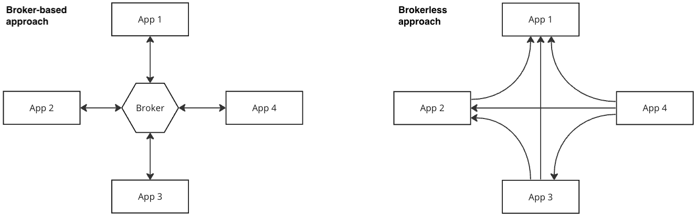
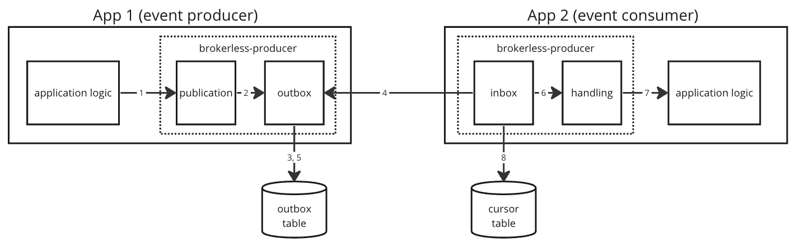

# Brokerless Event Platform

## Goals

This project provides a platform for event-driven communication between applications. The approach removes the necessity of maintaining centralized broker component. Instead, every application connects directly to other applications via REST API.

The concept is presented on the following diagram:



This architecture has the following benefits:
1. exactly-once delivery semantics,
2. allows transactional distributed data management,
3. no need to maintain the broker which is additional single point of failure.

There are also following drawbacks:
1. large-scale platforms might suffer from choreographic (not centralized) approach

## Event flow

The following diagram explains the event flow from the moment it is generated in the producer application logic to the moment it is handled by the consumer application logic. The example assumes that there is event `SampleEvent` that is produced by application `App1` and consumed by application `App2`.



1. Event producer application logic publishes an event using the *brokerless-producer* library within an existing database transaction. For example:
```java
eventPublisher.publishEvent(new SampleEvent("Sample message"));
```

2. & 3. The *brokerless-producer* library appends the event to the outbox table.

4. The *brokerless-consumer* library runs a periodic query via HTTP GET to the event producer application and to fetch events older than the cursor. The endpoint is exposed by *brokerless-producer* library.

5. The *brokerless-producer* library fetches the event from the outbox table and returns in the query response.

7. The *brokerless-consumer* library deserializes the event and passes it for handling.

8. The *brokerless-consumer* library triggers event handlers in the consumer application logic. This can be an example of a event handler implementation:
```java
  @BrokerlessEventHandler
  public void handleSampleEvent(SampleEvent event) {
    log.debug("Event message: " + event.getMessage());
  }
```

9. In case the event handler completed successfully the cursor is changed in the cursor table.


## Build project

```shell
mvn clean package -DskipTests && d build -t brokerless-sample-application:1 .
```

## Showcases

1. Application runs locally, in integration test and in docker with the same persistence configuration using Postgresql 
